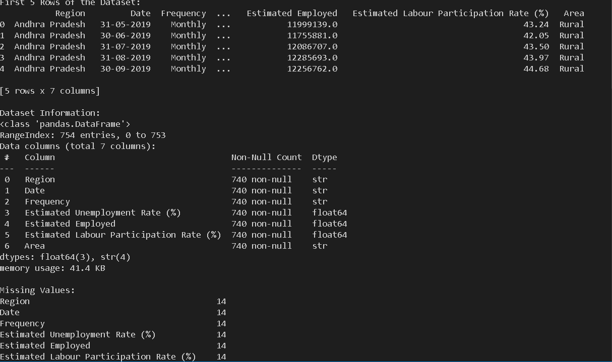
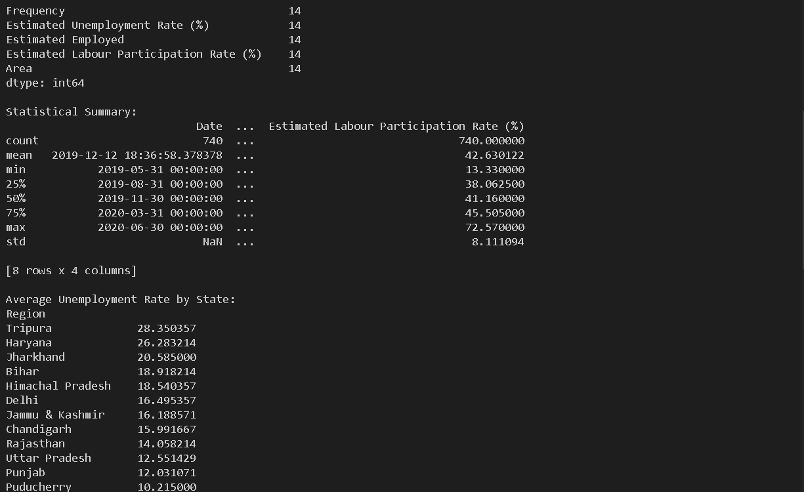
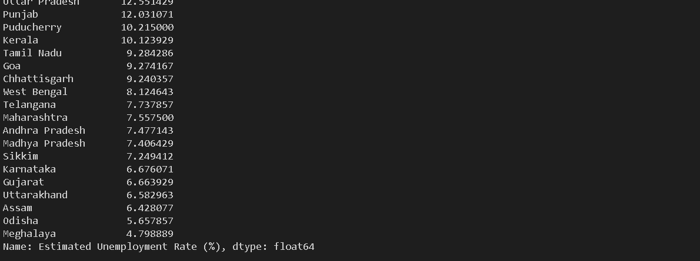
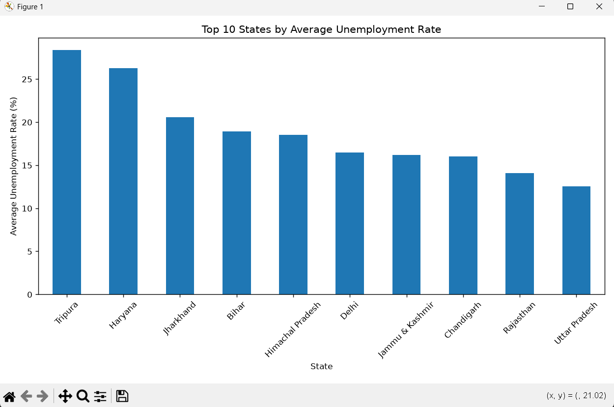
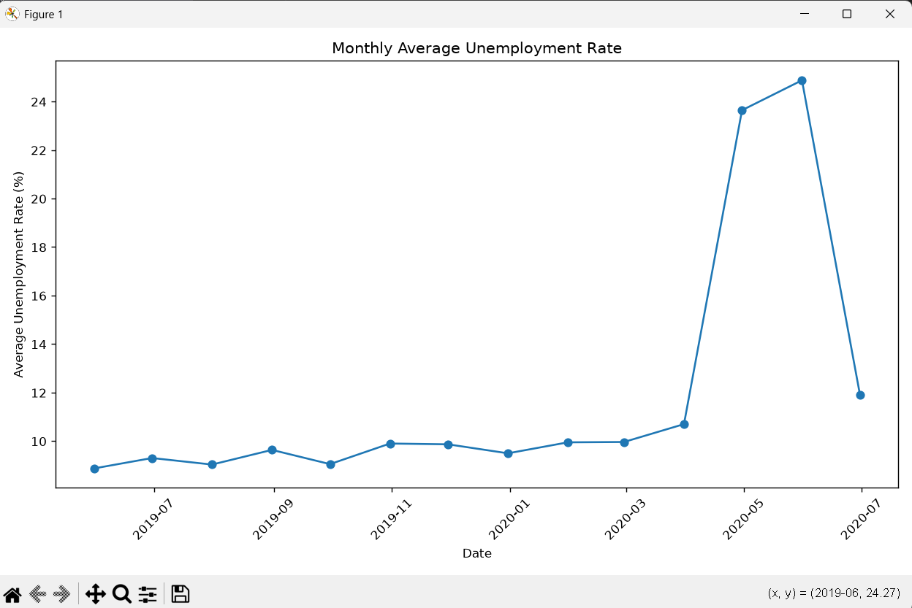
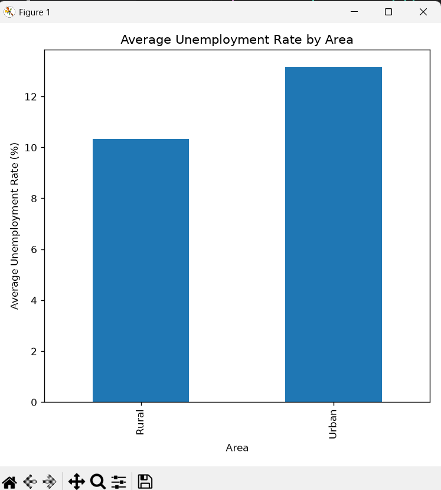

# Unemployment Analysis with Python

## Objective
This project analyzes unemployment data in India using Python. It examines unemployment trends across different states and compares unemployment rates in rural and urban areas.

## Tools Used
- Python
- Pandas
- Matplotlib

## Dataset
The dataset contains:
- Region
- Date
- Estimated Unemployment Rate (%)
- Estimated Employed
- Labour Participation Rate (%)
- Area

## Features
- Data loading and cleaning
- Missing value analysis
- Top 10 states by unemployment rate
- Monthly unemployment trend
- Rural vs Urban unemployment comparison

## How to Run
1. Install the required libraries:
   ```
   pip install -r requirements.txt
   ```
2. Run:
   ```
   python main.py
   ```

## Output
Graphs generated:
- Top 10 States by Average Unemployment Rate
- Monthly Average Unemployment Trend
- Rural vs Urban Unemployment Comparison
## Output Screenshots

### Output 1



### Output 2



### Output 3


### Output 4



### Output 5



### Output 6



### Output 7


## Conclusion
This project demonstrates how Python can be used for data analysis and visualization to understand unemployment trends.