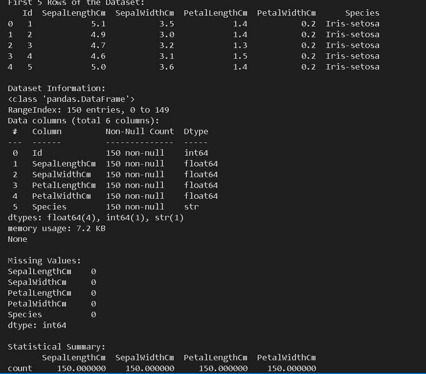
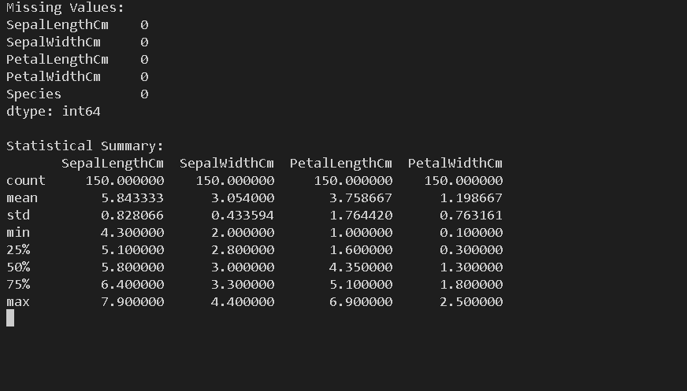
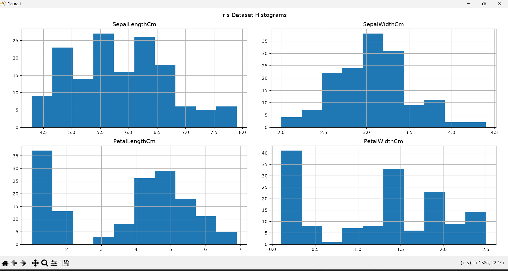
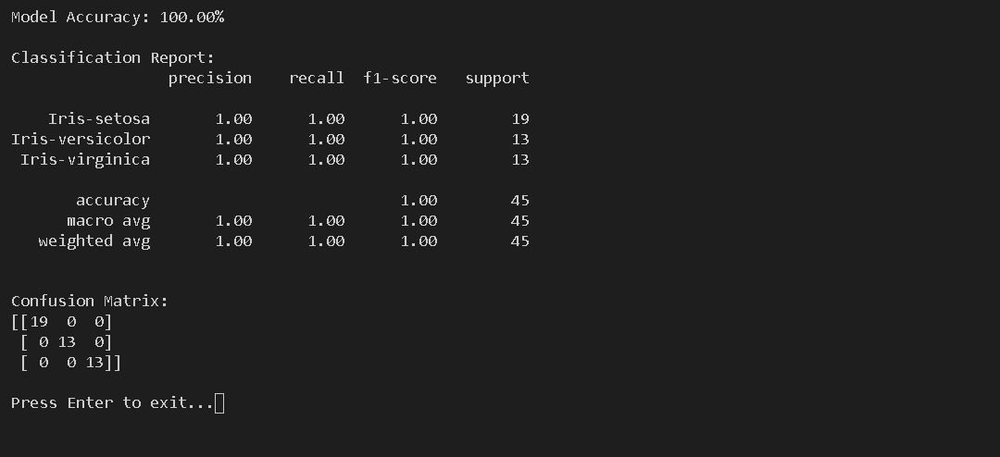

# Iris Flower Classification

## Objective

The objective of this project is to build a Machine Learning model that classifies Iris flowers into three species based on their measurements.

## Dataset

The dataset contains measurements of Iris flowers:

- Sepal Length
- Sepal Width
- Petal Length
- Petal Width

The target classes are:

- Iris-setosa
- Iris-versicolor
- Iris-virginica

## Technologies Used

- Python
- Pandas
- Scikit-learn
- Matplotlib

## Project Workflow

1. Load the Iris dataset.
2. Explore and preprocess the dataset.
3. Split the dataset into training and testing sets.
4. Train a Random Forest Classifier.
5. Predict the species of test samples.
6. Evaluate the model using accuracy and classification metrics.

## How to Run

1. Clone the repository:

```bash
git clone <repository-link>
```

2. Install the required libraries:

```bash
pip install -r requirements.txt
```

3. Run the project:

```bash
python main.py
```

## Output

The program displays:

- Dataset Information
- Missing Values
- Statistical Summary
- Histograms of Iris Features
- Model Accuracy
- Classification Report
- Confusion Matrix

## Output Screenshots

### Output 1



### Output 2



### Output 3


### Output 4




## Conclusion

The Random Forest Classifier successfully classifies Iris flowers into their respective species with high accuracy. This project demonstrates the basic workflow of a Machine Learning classification model using Python and Scikit-learn.