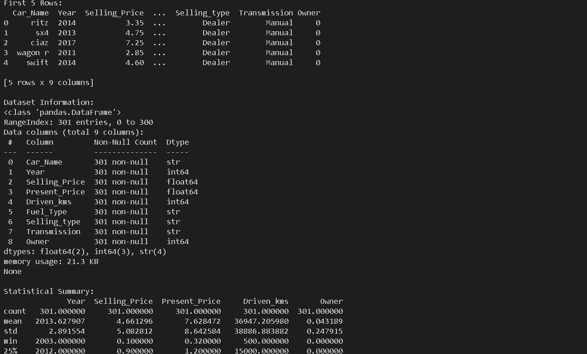
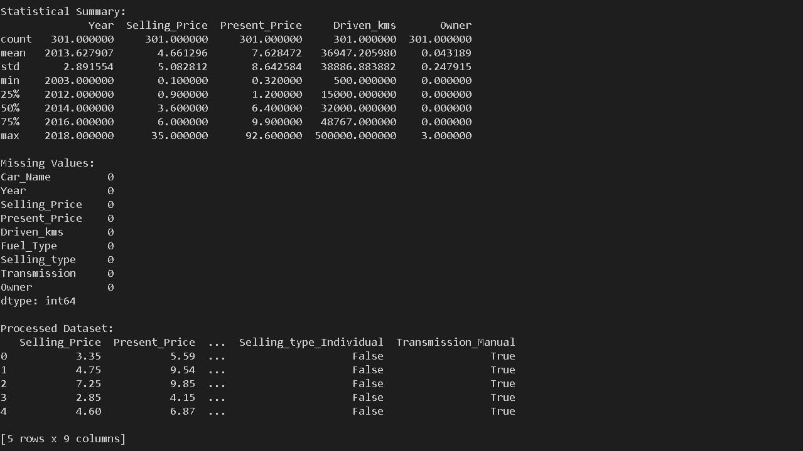
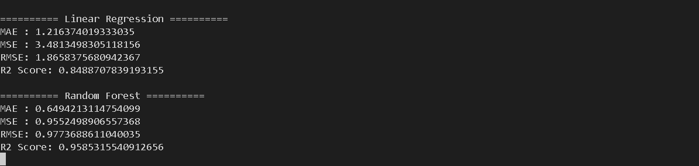
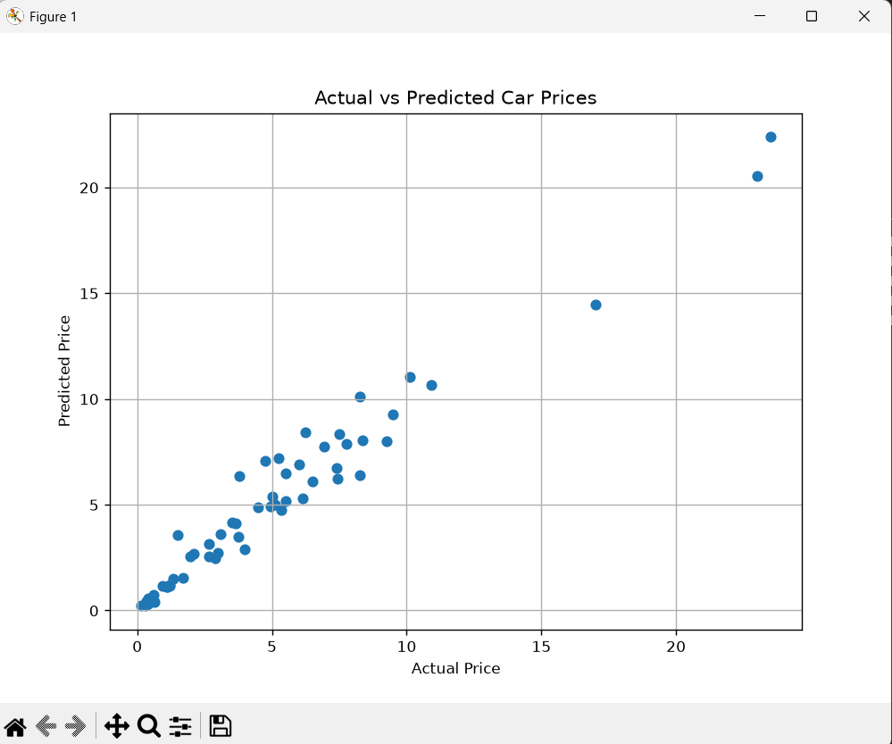
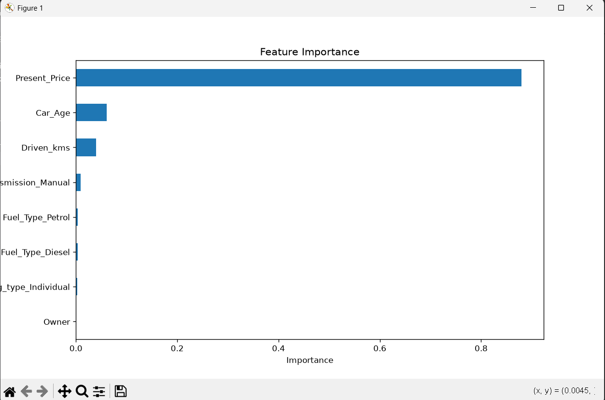
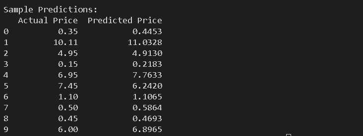

# Car Price Prediction using Machine Learning

## 📌 Project Overview
This project predicts the selling price of a used car using Machine Learning techniques. The dataset contains information such as the car's year, present price, kilometers driven, fuel type, transmission type, seller type, and owner details. The model is trained to estimate the selling price based on these features.

---

## 🎯 Objective
- Analyze the car price dataset.
- Perform data preprocessing and feature engineering.
- Train Machine Learning models to predict car prices.
- Compare model performance using evaluation metrics.
- Visualize the prediction results.

---

## 📂 Dataset
The dataset includes the following features:

- Car_Name
- Year
- Selling_Price (Target Variable)
- Present_Price
- Driven_kms
- Fuel_Type
- Selling_type
- Transmission
- Owner

---

## 🛠️ Technologies Used

- Python
- Pandas
- NumPy
- Matplotlib
- Scikit-learn

---

## 🤖 Machine Learning Models

- Linear Regression
- Random Forest Regressor

---

## 📊 Evaluation Metrics

The models are evaluated using:

- Mean Absolute Error (MAE)
- Mean Squared Error (MSE)
- Root Mean Squared Error (RMSE)
- R² Score

---

## 📈 Output

The project generates:

- Dataset Information
- Data Summary
- Missing Value Analysis
- Linear Regression Performance
- Random Forest Performance
- Actual vs Predicted Price Graph
- Feature Importance Graph

---

## 📁 Project Structure

```
Task3_Car_Price_Prediction/
│── data/
│   └── car_data.csv
│── screenshots/
│── main.py
│── README.md
│── requirements.txt
└── .gitignore
```

---

## ▶️ How to Run

1. Clone the repository.
2. Install the required libraries:

```
pip install -r requirements.txt
```

3. Run the project:

```
python main.py
```

---

## 📷 Outputs:
### Output 1



### Output 2



### Output 3


### Output 4



### Output 5



### Output 6




## ✅ Conclusion

The Random Forest Regressor produced better prediction accuracy than Linear Regression for this dataset. The project demonstrates the complete Machine Learning workflow, including data preprocessing, feature engineering, model training, evaluation, and visualization.

---

## 👨‍💻 Author

**Sindhu**

CodeAlpha Data Science Internship