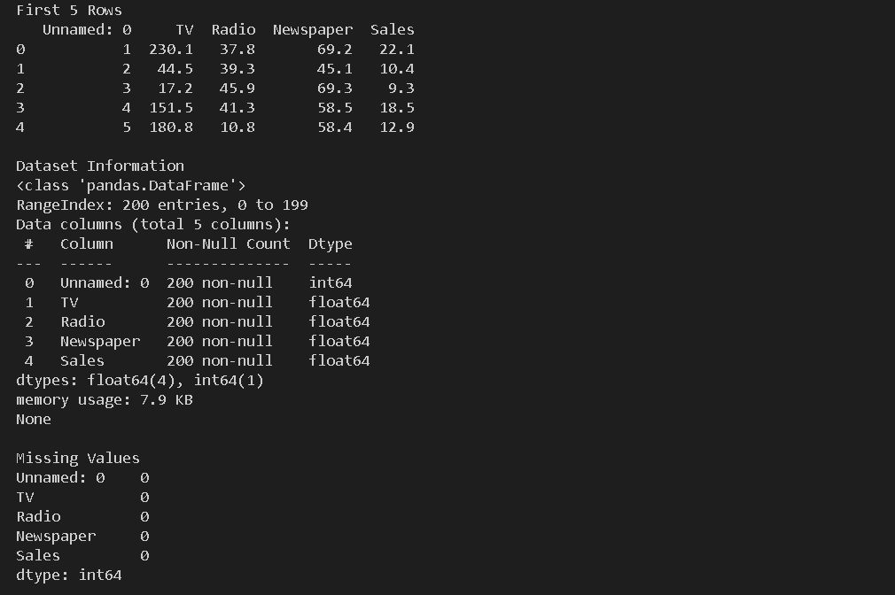
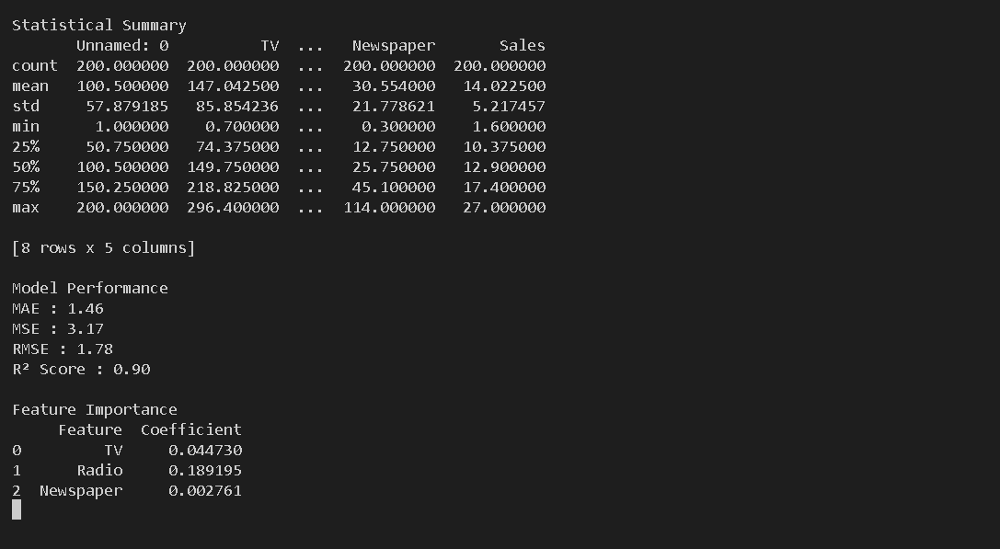
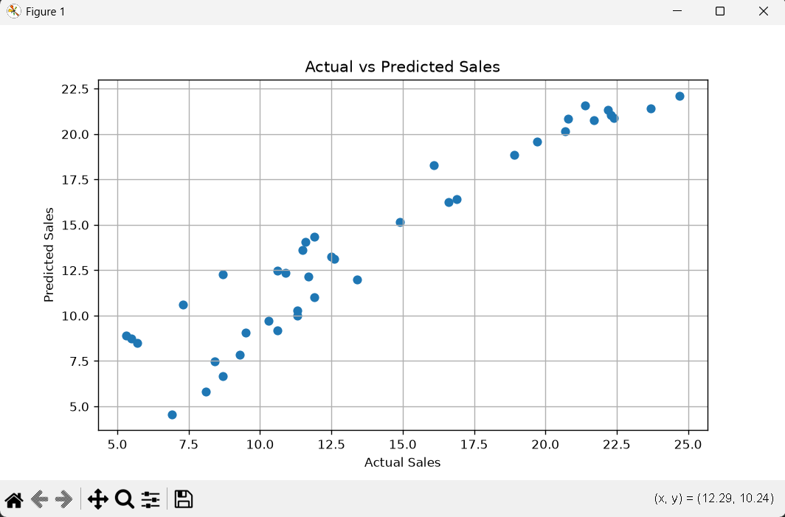
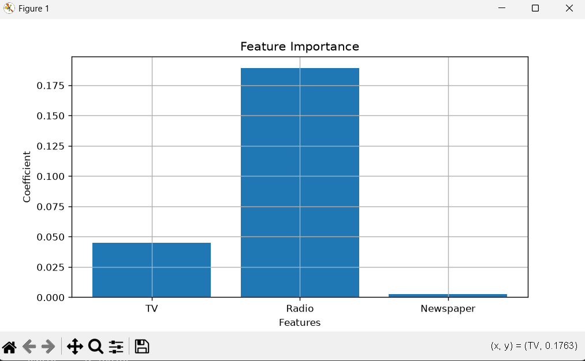
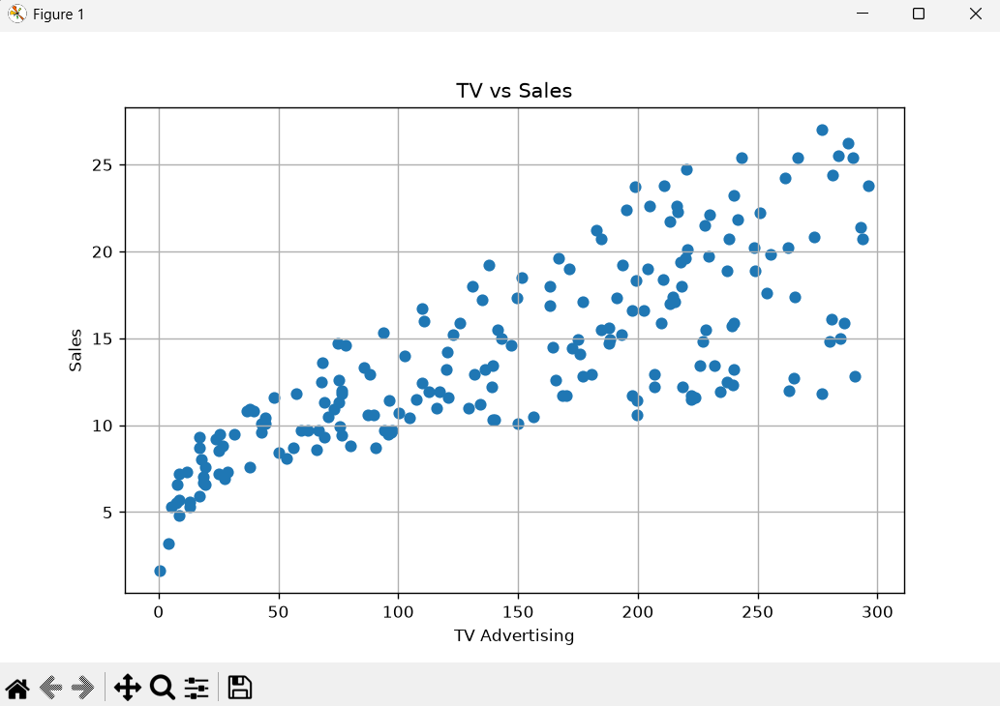
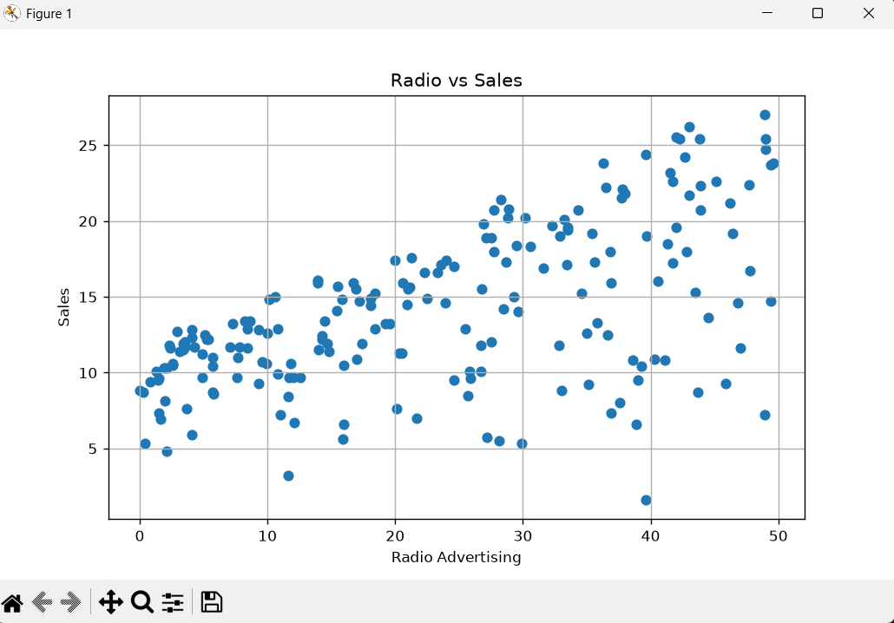
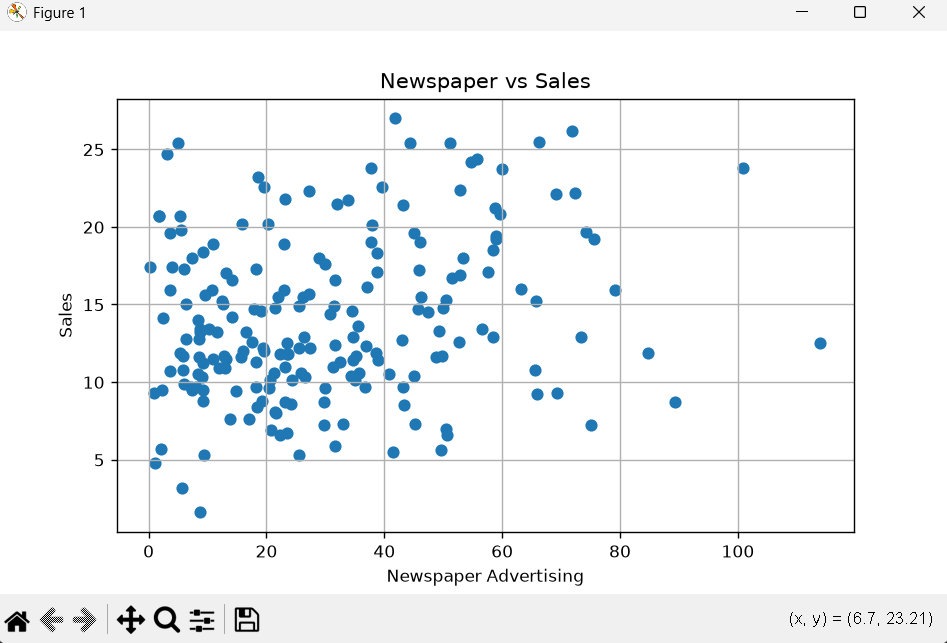
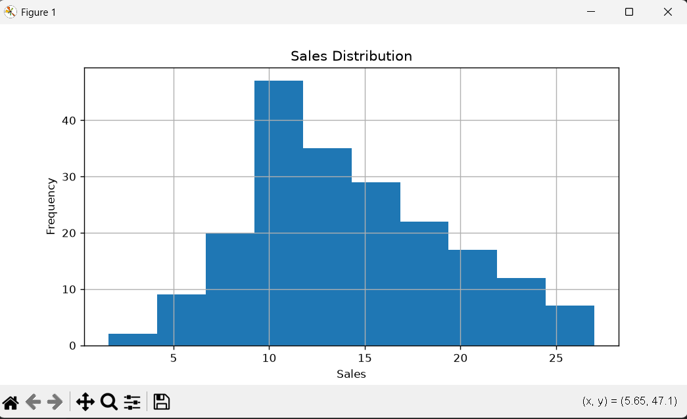
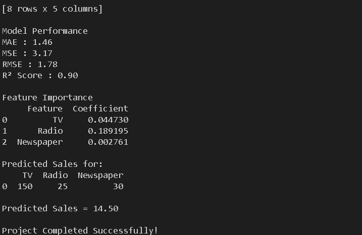

# Sales Prediction using Python

## Project Overview

This project predicts product sales based on advertising expenditures across different media platforms such as TV, Radio, and Newspaper using Machine Learning.

A Linear Regression model is trained to estimate future sales and analyze how advertising investments influence sales performance.

---

## Dataset

Dataset: Advertising Sales Dataset

Features:
- TV Advertising Budget
- Radio Advertising Budget
- Newspaper Advertising Budget

Target:
- Sales

---

## Technologies Used

- Python
- Pandas
- NumPy
- Matplotlib
- Scikit-learn

---

## Machine Learning Workflow

1. Data Loading
2. Data Cleaning
3. Feature Selection
4. Train-Test Split
5. Linear Regression Model
6. Model Evaluation
7. Sales Prediction
8. Visualization

---

## Model Evaluation Metrics

- Mean Absolute Error (MAE)
- Mean Squared Error (MSE)
- Root Mean Squared Error (RMSE)
- R² Score

---

## Output Visualizations

- TV vs Sales
- Radio vs Sales
- Newspaper vs Sales
- Actual vs Predicted Sales
- Feature Importance

---

## Project Structure

Task4_Sales_Prediction/
├── data/
│ └── advertising.csv
├── outputs/
│ ├── output1.png
│ ├── output2.png
│ ├── output3.png
│ ├── output4.png
│ ├── output5.png
│ ├── output6.png
│ ├── output7.png
│ ├── output8.png
│ └── output9.png
├── main.py
├── requirements.txt
├── README.md
└── .gitignore

## 📷 Outputs:
### Output 1

### Output 2

### Output 3

### Output 4

### Output 5

### Output 6

### Output 7

### Output 8

### Output 9

## Conclusion

The Linear Regression model successfully predicts sales based on advertising expenditure. TV and Radio advertising generally have a stronger impact on sales than Newspaper advertising, making them more effective channels for marketing investment.